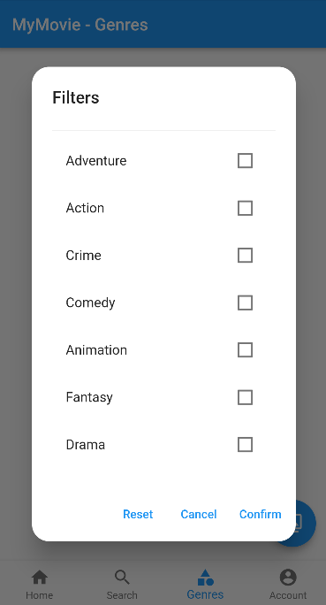

# MyMovie

A Small Movie Application

<div style="text-align: center;">


</div>

## Requirements
 - ### Flutter
 - ### Android Studio / Vscode
 - ### Internet connection


## How to run

- Run the App
  Go to the `app` directory.
  ```shell
    flutter run
  ```
- API:
 
  The Database is already hosted with Heroku with gitlabCI


## How to Use

- When the application is launched, you land on the HomePage.

<div style="text-align: center;">


</div>

- you can click on any movie to see the detail about a movie

<div style="text-align: center;">


</div>

- you'll find a number of useful information about each movie, like the synopsis, the genres associated with this movie or some screenshots

<div style="text-align: center;">


</div>

- you can search a movie by name

<div style="text-align: center;">


</div>

- you can search a movies by genres

<div style="text-align: center;">



</div>

- you can login/register to access more options

<div style="text-align: center;">


</div>

